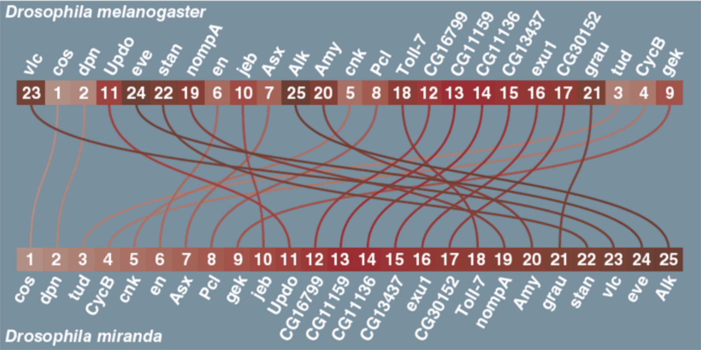
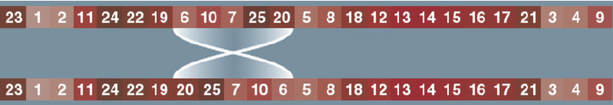

# Fruitvliegen

Drosophila Melanogaster en Drosophila Miranda zijn fruitvliegsoorten waarvan het genoom goed bestudeerd is. Voor deze twee soorten geldt dat de genen voor beide soorten identiek zijn, maar wel in een andere volgorde staan. 
Zoals hier te zien:


Mutaties in de genenrij van de Drosophila vinden alleen plaats doordat subrijen ervan in hun geheel omkeren.
Zoals hier te zien:


Het is de zaak te achterhalen welke reeks van achtereenvolgende mutaties de ene fruitvliegensoort in de andere heeft doen veranderen. Misschien zijn er meerdere reeksen mogelijk; in dat geval willen we de meest plausibele reeks vinden: die met de kleinste mutaties en die met de minste mutaties.

## Aan De Slag (Getting Started)

### Verseisten (Prerequisites)

Deze codebase is volledig geschreven in [Python3.6.3](https://www.python.org/downloads/). In requirements.txt staan alle benodigde packages om de code succesvol te draaien. Deze zijn gemakkelijk te installeren via pip dmv. de volgende instructie:

```
pip install -r requirements.txt
```

### Structuur (Structure)

Alle Python scripts staan in de folder Code. In de map Data zitten alle input waardes en in de map resultaten worden alle resultaten opgeslagen door de code.

### Test (Testing)

Om de code te draaien met de standaardconfiguratie (bv. brute-force en voorbeeld.csv) gebruik de instructie:

```
python main.py
```

## Auteurs (Authors)

* Jurrian Schleuder
* Alwan Rashid
* Nordin Bouchrit

## Dankwoord (Acknowledgments)

* StackOverflow
* minor programmeren van de UvA
* Tamrell
